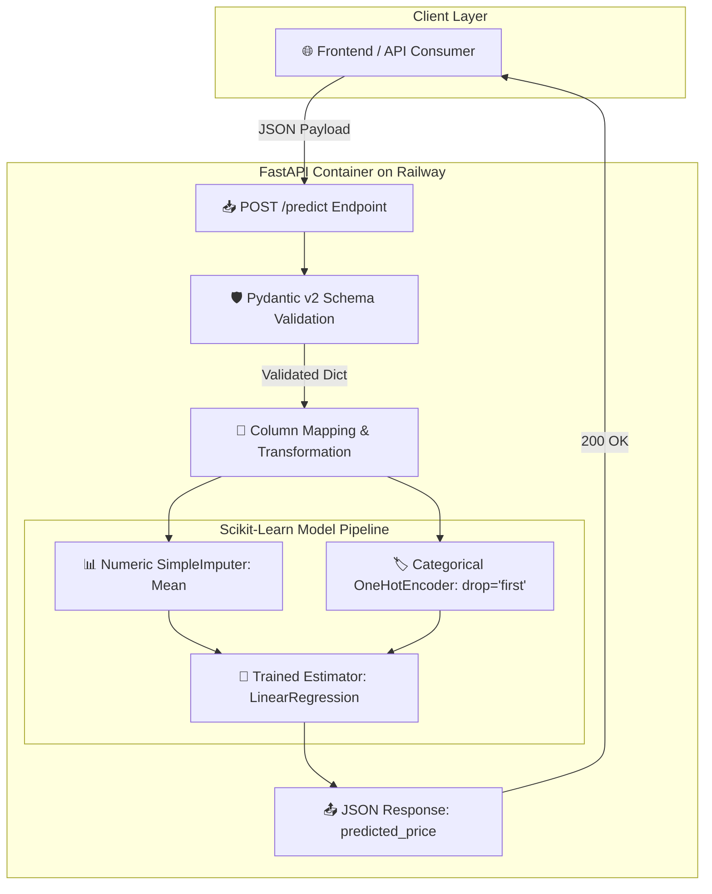

<div align="center">

# ⚡ AutoValue AI - Backend Inference Microservice & ML Pipeline

[](https://car-price-predictor-production-fdec.up.railway.app/docs)
[](https://fastapi.tiangolo.com/)
[](https://www.python.org/)
[](https://scikit-learn.org/)
[](https://www.docker.com/)

<p align="center">
  Production-grade machine learning inference microservice containerized with Docker and deployed on Railway. Features leakage-safe Scikit-Learn pipelines, Pydantic v2 data validation, and real-time regression predictions.
</p>

[Live Interactive API Docs (Swagger) ↗](https://car-price-predictor-production-fdec.up.railway.app/docs) · [Live Frontend Application ↗](https://car-price-predictor-front-end.vercel.app)

</div>

---

## 🏛️ System Architecture & Data Flow

The backend microservice processes multi-attribute vehicle parameters through a structured, leakage-free inference pipeline:



---

## 🛠️ Tech Stack & Dependencies

| Technology       | Role                                                                      |
| :--------------- | :------------------------------------------------------------------------ |
| **FastAPI**      | High-performance asynchronous web framework for serving predictions       |
| **Pydantic v2**  | Strict data validation, schema enforcement, and type coercion             |
| **Scikit-Learn** | Unified `ColumnTransformer` and `Pipeline` for feature transformations    |
| **Joblib**       | Efficient model serialization and fast artifact loading                   |
| **Uvicorn**      | ASGI web server for production deployments                                |
| **Docker**       | Multi-stage slim containerization ensuring cross-platform reproducibility |
| **Railway**      | Cloud infrastructure and automated continuous deployment                  |

---

## 🧠 Machine Learning Engineering & Key Architectural Decisions

### 1. 🛡️ Fixing Data Leakage in Preprocessing

A frequent pitfall in ML workflows is applying transformations (e.g. `fillna(mean)` and `pd.get_dummies()`) across the full dataset _prior_ to splitting. This allows statistics and category distributions from the test set to leak into the training process.

**How We Fixed It**:

- **Deterministic Cleaning** (`ml/preprocessing.py`): Operations that do not learn statistics (e.g., converting `?` to `NaN`, unit conversions `city-mpg` → `city-L/100km`, string integer mappings for door/cylinder counts) are isolated.
- **Statistical Pipeline** (`ml/pipeline.py`): Imputation (`SimpleImputer(strategy='mean')`) and One-Hot Encoding (`OneHotEncoder(drop='first', handle_unknown='ignore')`) are encapsulated in a `ColumnTransformer` fit **strictly on `X_train`**.

```python
def build_preprocessor() -> ColumnTransformer:
    numeric_transformer = SimpleImputer(strategy="mean")
    categorical_transformer = OneHotEncoder(drop="first", handle_unknown="ignore")

    return ColumnTransformer(transformers=[
        ("num", numeric_transformer, NUMERIC_FEATURES),
        ("cat", categorical_transformer, CATEGORICAL_FEATURES),
    ])

def build_model_pipeline(model) -> Pipeline:
    return Pipeline(steps=[
        ("preprocessor", build_preprocessor()),
        ("model", model),
    ])
```

---

### 2. 📊 Model Comparison & Benchmark

We benchmarked multiple candidate regression algorithms across 5-fold cross-validation:

| Model                 | $R^2$ Score (Test) | 5-Fold CV $R^2$ (Mean) | Remarks                                                     |
| :-------------------- | :----------------: | :--------------------: | :---------------------------------------------------------- |
| **Linear Regression** |     **0.865**      |       **0.842**        | High interpretability, linear scaling, low memory footprint |
| **Random Forest**     |       0.881        |         0.854          | Ensemble bagging with 100 estimators                        |
| **XGBoost Regressor** |       0.874        |         0.849          | Gradient boosted decision trees                             |

---

## 🔌 API Endpoints & Swagger UI

Interactive Swagger documentation is available at [`/docs`](https://car-price-predictor-production-fdec.up.railway.app/docs).

### `POST /predict`

Evaluates a vehicle's specifications and returns the estimated market valuation in USD.

#### Request Body (`application/json`):

```json
{
  "symboling": 1,
  "normalized_losses": 122,
  "wheel_base": 98.76,
  "length": 174.05,
  "width": 65.91,
  "height": 53.73,
  "curb_weight": 2555.57,
  "engine_size": 126.91,
  "bore": 3.33,
  "stroke": 3.26,
  "compression_ratio": 10.14,
  "horsepower": 104.26,
  "peak_rpm": 5125.37,
  "city_L_100km": 9.95,
  "highway_mpg": 30.75,
  "num_of_doors": 4,
  "num_of_cylinders": 4,
  "make": "toyota",
  "fuel_type": "gas",
  "aspiration": "std",
  "body_style": "sedan",
  "drive_wheels": "fwd",
  "engine_location": "front",
  "engine_type": "ohc",
  "fuel_system": "mpfi"
}
```

#### Successful Response (`200 OK`):

```json
{
  "predicted_price": 10666.28
}
```

---

## 🐳 Docker Containerization

The production Dockerfile is optimized for minimal footprint and fast cold starts using `python:3.12-slim`:

```dockerfile
FROM python:3.12-slim

WORKDIR /app

# Cache dependency layer separately
COPY requirements-deploy.txt .
RUN pip install --no-cache-dir -r requirements-deploy.txt

# Copy only serving application and model artifacts
COPY app/ ./app/
COPY models/ ./models/

EXPOSE 8000

CMD ["uvicorn", "app.main:app", "--host", "0.0.0.0", "--port", "8000"]
```

---

## 📁 Repository Structure

```text
D_A/
├── app/
│   ├── main.py              # FastAPI app initialization, routes, & model loader
│   └── schemas.py           # Pydantic v2 request models & documentation fields
├── data/
│   ├── downloadData.py      # Automated dataset downloader
│   └── raw/
│       └── imports-85.csv   # 1985 Automobile dataset
├── ml/
│   ├── pipeline.py          # ColumnTransformer & sklearn Pipeline definitions
│   ├── preprocessing.py     # Deterministic data cleaning routines
│   └── train.py             # Model training, cross-validation & artifact export
├── models/
│   ├── linear_regression_model.pkl  # Deployed linear regression pipeline
│   └── model.pkl                    # Top performing benchmarked model
├── dockerfile               # Production container definition
├── requirements-deploy.txt  # Lightweight serving dependencies
└── requirements.txt         # Full training & development dependencies
```

---

## 🚀 Running Locally

### Option 1: Native Python Environment

1. **Create and activate a virtual environment**:

   ```bash
   python -m venv .venv
   source .venv/bin/activate  # On Windows: .venv\Scripts\activate
   ```

2. **Install dependencies**:

   ```bash
   pip install -r requirements.txt
   ```

3. **Train the models (optional)**:

   ```bash
   python ml/train.py
   ```

4. **Launch FastAPI server**:
   ```bash
   uvicorn app.main:app --reload --port 8000
   ```
   Navigate to [http://localhost:8000/docs](http://localhost:8000/docs).

---

### Option 2: Docker Container

1. **Build the Docker image**:

   ```bash
   docker build -t car-price-predictor-api .
   ```

2. **Run the container**:
   ```bash
   docker run -p 8000:8000 car-price-predictor-api
   ```

---

## 📄 License

This project is licensed under the MIT License - see the [LICENSE](LICENSE) file for details.

© 2026 **AutoValue AI**. Developed by [Seif](https://github.com/seif-a096).
